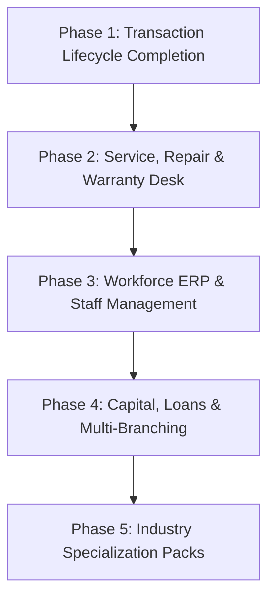

# 🏛️ VERISTOCK PRO — Comprehensive Android vs. Web Cross-Platform Audit & Future Roadmap

**Document Version:** 3.0  
**Audit Date:** September 8, 2026  
**Auditor:** Antigravity AI Engineering Architecture Desk  
**Scope:** Android POS Native OS (`app/`, `data-persistence/`) vs. Cloud Desktop Web Application (`web-app/`)  
**Supreme Law:** Constitution v2.7.2 & Cross-Platform Parity Contract v1.0  

---

## Executive Summary

VeriStock Pro has reached a milestone: the core desktop web application has been transformed from a single-page prototype into an enterprise-grade cloud POS system deployed live at **`https://veristock-ad58d.web.app`**. It possesses complete Money Law compliance, native IndexedDB offline queuing, ESC/POS hardware thermal printing, sub-second Firestore listeners, and full statutory second-hand mobile KYC verification.

However, the Android application currently houses **52 feature modules** covering 18 industry verticals, a complete Workforce ERP, repair/service desk, manufacturing BOM, restaurant table/KOT management, capital loan trackers, and multi-shop command centres.

This document delivers a **systematic, exhaustive feature-by-feature cross-check** between Android and Web, detailing what is live today, what gaps exist, and a phased execution blueprint for future AI agents and software engineers.

---

## 📊 Comprehensive Feature-by-Feature Cross-Check Matrix

| Category / Domain | Android Feature Module | Android State | Web App Current State | Parity Status | Missing Web Capabilities |
|---|---|---|---|---|---|
| **POS & Billing** | `feature/pos`, `feature/billing` | Full POS, offline outbox, split pay, barcode, weighing scale | `quickPosModule.js`, `hardware.js` | 🟢 **90% Parity** | Weighing scale serial driver, custom discount percent rule per item. |
| **Sales History** | `feature/sales`, `feature/saledetail` | Invoices, reprint, PDF invoice generator | `salesModule.js` | 🟢 **95% Parity** | PDF A4 GST Tax Invoice download (currently browser print/thermal only). |
| **Quotations & Estimates** | `feature/billing` (Quotation) | Quotation generator, convert quotation to invoice | ❌ None | 🔴 **0% (Missing)** | Full Quotation builder (`quotations/{docId}`), quotation PDF print, 1-click convert to POS invoice. |
| **Sale Returns & Refunds** | `feature/salereturn` | Credit notes, item return to stock, refund mode | ❌ None | 🔴 **0% (Missing)** | Credit Note builder (`sale_returns/{docId}`), stock auto-restock, cash deduction. |
| **Purchases & COGS** | `feature/purchase` | Inward purchase invoice, supplier lookup, COGS | `purchasesModule.js` | 🟢 **90% Parity** | Inward purchase bill entry modal (currently read-only stream + Day Book). |
| **Purchase Returns** | `feature/purchasereturn` | Debit notes, supplier balance adjustment | ❌ None | 🔴 **0% (Missing)** | Debit Note builder (`purchase_returns/{docId}`), supplier ledger debit. |
| **Used Device Vault** | `feature/mobile`, `feature/imei` | Second-hand stock, aging alert, condition grade | `inventoryVault.js` | 🟢 **100% Parity** | None. Full parity achieved with aging alerts (>30d), condition badges, quick resale modal. |
| **Statutory KYC Registry** | `feature/kyc` | 5 photos, thumb biometric, police verification | `kycRegister.js`, `oldDeviceBuy.js`, `kycPrintEngine.js` | 🟢 **100% Parity** | None. Full parity achieved with WebCrypto SHA-256 hash, Firebase Storage photo uploads, and IPC/BNS statutory docket print. |
| **Products & Catalog** | `feature/products` | SKU, barcode, brand, category, low stock | `productsModule.js` | 🟡 **80% Parity** | Add/Edit product modal on web (currently live stream viewer). |
| **Day Book / Cash Flow** | `feature/accounting` | Daily cash statement, running balance, DEBIT/CREDIT | `dayBookModule.js` | 🟢 **100% Parity** | None. Complete chronological ledger with date navigation and Money Law reading. |
| **Expenses Tracker** | `feature/expenses` | Category breakdown, Cash in hand deduction | `expensesModule.js` | 🟢 **100% Parity** | None. Real-time expenses, monthly/weekly KPIs, + Add Expense modal with cash deduction. |
| **Customer Khata (Receivables)** | `feature/customers`, `feature/collection` | Dues tracking, customer statement, collection entry | `customerLedgerModule.js` | 🟢 **95% Parity** | Full parity. Live khata, balance due, collection modal. (Missing: SMS / WhatsApp payment reminder trigger). |
| **Supplier Ledger (Payables)** | `feature/suppliers`, `feature/supplier` | Vendor balance, bill reconciliation, payment entry | `supplierLedgerModule.js` | 🟢 **100% Parity** | Full parity. Accounts payable, balance due, payment recording modal. |
| **CA Compliance & Tax Desk** | `feature/ca`, `feature/castudio` | GSTR-1, GSTR-3B, 5-slab GST, Margin Scheme audit | `caHub.js` | 🟢 **100% Parity** | None. Real-time 4-stream subscriptions, GSTN JSON export, Rule 32(5) Margin Scheme audit ledger. |
| **Business Settings & Identity** | `feature/settings`, `feature/profile` | GSTIN, PAN, shop profile, logo, signature | `settingsModule.js` | 🟢 **90% Parity** | Profile edit/view live. (Missing: Logo & signature upload to Firebase Storage). |
| **Repair & Service Desk** | `feature/repair` | Job tickets, diagnosis, technician assignment, status stages | ❌ None | 🔴 **0% (Missing)** | Complete Repair Desk (`repair_jobs/{docId}`), stage pipeline (Intake -> Diagnosis -> Parts -> Ready -> Delivered). |
| **AMC & Service Contracts** | `feature/service` | Annual maintenance contract, service call scheduling | ❌ None | 🔴 **0% (Missing)** | AMC management (`service_contracts/{docId}`, `service_calls/{docId}`). |
| **Warranty Tracking** | `feature/warranty` | Serial number warranty check, claim intake | ❌ None | 🔴 **0% (Missing)** | Warranty claim registry (`warranty/{docId}`). |
| **Workforce Attendance** | `feature/staff` | Staff biometric/punch, geolocation radar, breaks | ❌ None | 🔴 **0% (Missing)** | Staff attendance desk (`staff_attendance/{docId}`, `staff_breaks/{docId}`). |
| **Staff Payroll & Advances** | `feature/staff` | Salary calculation, advance wallet, commission | ❌ None | 🔴 **0% (Missing)** | Staff payroll desk (`staff_payroll/{docId}`, `staff_advances/{docId}`). |
| **Capital Investors & Loans** | `feature/capital`, `feature/loans` | Business loans, EMI tracker, equity investor payouts | ❌ None | 🔴 **0% (Missing)** | Loan & capital suite (`business_loans/{docId}`, `investors/{docId}`). |
| **Multi-Shop Command Centre** | `feature/commandcentre` | Branch switching, centralized stock search, device auth | 🟡 Partial | 🟠 **30% Parity** | Topbar displays shop name, but lacks multi-shop dropdown switcher and device authorization approval desk. |
| **Restaurant KOT & Tables** | `feature/restaurant` | Table layout, Kitchen Order Ticket print, kot status | ❌ None | 🔴 **0% (Missing)** | Table layout manager, KOT thermal printer routing (`kot/{docId}`). |
| **Manufacturing Suite & BOM** | `feature/manufacture` | Bill of Materials, production orders, job-work challan | ❌ None | 🔴 **0% (Missing)** | Manufacturing desk (`boms/{docId}`, `production_orders/{docId}`, `job_work/{docId}`). |
| **Pharmacy Expiry & Batches** | `feature/batch` | Batch number, expiry date alerts, strip splitting | ❌ None | 🔴 **0% (Missing)** | Batch & expiry management (`batch_inventory`). |
| **Garment Variant Matrix** | `feature/garments` | Size x Color 2D grid matrix inventory | ❌ None | 🔴 **0% (Missing)** | 2D variant matrix grid. |
| **Clinic / Healthcare Desk** | `feature/clinic`, `feature/healthcare` | Patient intake, doctor prescription, case history | ❌ None | 🔴 **0% (Missing)** | Patient clinic desk (`patients/{docId}`, `prescriptions/{docId}`). |
| **EMI Financing Desk** | `feature/emi` | Finance partner, down payment, installment schedule | ❌ None | 🔴 **0% (Missing)** | EMI finance application tracker (`emi/{docId}`). |
| **Wholesale Price Slabs** | `feature/wholesale` | Tiered pricing (1-10 pcs: ₹500, 10-50 pcs: ₹450) | ❌ None | 🔴 **0% (Missing)** | Multi-tier wholesale price engine. |

---

## 🎯 What To Do Next: Phased Master Blueprint for Developers & AI Agents

To systematically bridge the gap while maintaining the frozen architecture, future development must follow this **5-phase sequence**:

---

### 🔹 Phase 1: Transaction Lifecycle Completion (P1 — Immediate Priority)
**Goal:** Complete the circular sales cycle so a desktop operator never needs to touch the mobile device for counter transactions.

1. **Quotations / Estimates Builder (`quotationsModule.js`):**
   - Collection: `/businesses/{bizId}/shops/{shopId}/quotations/{quotationId}`
   - Allow adding customer name, item rows, tax rates, and terms.
   - 1-Click "Convert to Invoice" button that automatically loads items directly into `QuickPosModule`.
   - Standard PDF / print estimate slip.
2. **Sale Returns & Credit Notes (`saleReturnsModule.js`):**
   - Collection: `/businesses/{bizId}/shops/{shopId}/sale_returns/{returnId}`
   - Input original invoice number, select items being returned, record condition (restockable vs damaged).
   - Automatically restock product quantity in inventory.
   - Record `DEBIT` cash outflow in `business_ledger` (Day Book) or customer credit note.
3. **Inward Product Creation Modal (`productsModule.js`):**
   - Add `+ New Product` modal with fields: Item Name, Barcode/SKU, HSN Code, Purchase Price, Selling Price, MRP, Tax Slab (0, 5, 12, 18, 28%), Minimum Alert Stock.
   - Enforce Money Law: Store `purchasePricePaise` and `sellingPricePaise`.
4. **Multi-Shop Dropdown Switcher (Topbar):**
   - Fetch all shops accessible to user (`member.shopIds` or Owner's shops).
   - Switching the dropdown dynamically updates `tenant.shopId`, detaches previous Firestore listeners, and mounts active module for the new shop.

---

### 🔹 Phase 2: Service, Repair & Warranty Desk (P2 — High Business Value)
**Goal:** Support Technical Service industries (Mobile, Electronics, Automotive, Hardware).

1. **Repair Job Ticket Desk (`repairJobsModule.js`):**
   - Collection: `/businesses/{bizId}/shops/{shopId}/repair_jobs/{jobId}`
   - Kanban / Status Pipeline: `INTAKE` ➔ `DIAGNOSIS` ➔ `AWAITING_PARTS` ➔ `REPAIRED` ➔ `DELIVERED`.
   - Fields: Customer info, device model, serial/IMEI, customer reported problem, physical condition check, technician assigned, estimated cost, advance payment.
   - Thermal/A4 Job Card intake receipt print for customer.
   - Upon `DELIVERED`, automatically generate a POS billing invoice for service charges + replacement spare parts.
2. **Warranty Claims Registry (`warrantyModule.js`):**
   - Collection: `/businesses/{bizId}/shops/{shopId}/warranty/{warrantyId}`
   - Search by device IMEI or Serial Number to check warranty expiry and claim history.
3. **AMC & Service Contracts (`serviceContractsModule.js`):**
   - Collection: `/businesses/{bizId}/shops/{shopId}/service_contracts/{contractId}`
   - Schedule upcoming maintenance visits, record periodic service calls.

---

### 🔹 Phase 3: Workforce ERP & Staff Desk (P3)
**Goal:** Complete multi-user store management on desktop.

1. **Staff Directory & Invite System (`staffModule.js`):**
   - Manage store staff: Cashier, Technician, Sales, Store Manager, Accountant.
   - Trigger Firebase Cloud Function `sendStaffInviteEmail` for onboarding.
2. **Attendance & Shift Management (`attendanceModule.js`):**
   - Collection: `/businesses/{bizId}/shops/{shopId}/staff_attendance/{attId}`
   - Today's staff roster: Present, On Break, Absent, Shift timings.
   - Review and approve staff attendance corrections.
3. **Staff Advances & Payroll Processing (`payrollModule.js`):**
   - Collections: `staff_advances`, `staff_payroll`
   - Salary advance wallet: record advance cash disbursed with auto Day Book entry.
   - Monthly payroll sheet calculator: Base pay - Advances + Commissions - Unpaid leaves.

---

### 🔹 Phase 4: Capital, Loans & Multi-Branching (P4)
**Goal:** Support enterprise retail operations, financing, and banking.

1. **Business Loans & EMI Repayments (`loansModule.js`):**
   - Collection: `/businesses/{bizId}/shops/{shopId}/business_loans/{loanId}`
   - Active bank loans, tenure, interest rate, EMI due dates.
   - Record monthly EMI payment: auto `DEBIT` from Day Book.
2. **Capital Investors & Equity Partners (`investorsModule.js`):**
   - Collection: `/businesses/{bizId}/shops/{shopId}/investors/{investorId}`
   - Track capital injections, equity percentages, and dividend payout history.
3. **Central Command Centre & Terminal Management (`commandCentreModule.js`):**
   - Collection: `/businesses/{bizId}/devices/{deviceId}`
   - Authorized Device Registry: View all active Android POS tablets and Web browser sessions.
   - Revoke compromised browser tokens or decommission old terminals.

---

### 🔹 Phase 5: Industry Specialization Packs (P5)
**Goal:** Specialized operational vertical engines.

1. **Restaurant Management:** Table floor grid, KOT dispatch to kitchen thermal printer (`kot/{kotId}`).
2. **Manufacturing & Job-Work:** Bill of Materials (BOM), Raw materials ➔ Finished goods conversion, worker job-work challans (`boms`, `production_orders`, `job_work`).
3. **Pharmacy & Grocery:** Batch number, expiry date tracker, near-expiry alerts, strip-to-tablet splitting.
4. **Garments & Footwear:** 2D Size x Color grid matrix for variant stock tracking.
5. **Clinic / Healthcare:** Patient registration, prescription writing, consultation fee billing.

---

## 🔒 Mandatory Invariants for All Future AI Agents & Developers

Any agent or developer working on the web application MUST enforce these non-negotiable rules:

1. **The Money Law (Zero Float Invariant):**
   - Database/Firestore stores integer **PAISE** (`amountPaise: 49900`).
   - UI and calculations display decimal **RUPEES** (`₹499.00`) using `formatCurrency()` and `paiseOrRupeesToRupees()`.
   - Rounding MUST follow standard GST banking rule: **`RoundingMode.HALF_UP`**.
2. **Firestore Outbox & Loopback Guard:**
   - Every write from the web app MUST attach `_clientSessionId: SESSION_ID` and `_platform: "web"`.
   - Real-time snapshot listeners must ignore mutations matching the current tab's `SESSION_ID` to eliminate feedback loops.
3. **Article 45 Binary Asset Rule:**
   - NEVER save raw Base64 data URIs (`data:image/...`) into Firestore documents.
   - Upload photos to Firebase Storage (`kyc_evidence/...`), obtain the HTTPS URL, and store strictly the URL string in Firestore.
4. **Single Master Firestore Schema Parity:**
   - All modules MUST write to the exact same path hierarchy as Android:
     `/businesses/{bizId}/shops/{shopId}/{collectionName}/{docId}`
   - No ad-hoc collections or custom field names.
5. **Zero Unilateral Destruction Law:**
   - Never delete core directories, entities, or schemas without explicit user consent.
   - Follow the Multi-Machine Git Synchronization Protocol: fetch-rebase before builds, stage and commit immediately upon verification, and prompt the user to push via GitHub Desktop.
